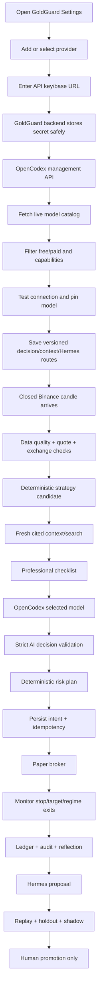

# OpenCodex GoldGuard Bot Implementation Plan

> **For agentic workers:** REQUIRED SUB-SKILL: Use superpowers:executing-plans to implement this plan task-by-task. Steps use checkbox (`- [ ]`) syntax for tracking.

**Goal:** Complete GoldGuard as an autonomous paper-first PAXG/USDT trading bot that uses an isolated OpenCodex gateway for provider/model access, live model selection, custom API keys, and optional web search while keeping trading authority deterministic and auditable.

**Architecture:** GoldGuard owns market data, strategy candidates, context-evidence validation, risk, state, persistence, paper/live broker gates, and audit. An isolated, pinned OpenCodex service owns provider adapters, custom OpenAI-compatible endpoints, upstream credentials, model discovery, protocol translation, and optional search mediation. Hermes remains a separate proposal-only research service.

**Tech Stack:** Python 3.12, FastAPI, Pydantic 2, httpx, SQLite/aiosqlite, pytest, Hypothesis, Ruff, mypy; React 19, TypeScript, Vite, Vitest, Testing Library, Playwright; Bun/Node for OpenCodex; Docker/Compose; Railway.

**Spec:** `docs/superpowers/specs/2026-08-26-opencodex-ai-gateway-design.md`

## Global Constraints

- Paper mode is the default; live capability is false and maximum live capital is zero by default.
- GoldGuard is the only authority allowed to calculate size, stop, target, risk, state, or broker actions.
- Missing, stale, uncited, contradictory, malformed, quota-limited, or unavailable context blocks new entries.
- Protective stops, targets, emergency exits, and reconciliation never depend on AI, news, Hermes, or OpenCodex availability.
- Every money value uses `Decimal` or a canonical decimal string; every timestamp is timezone-aware UTC.
- No withdrawal, transfer, margin, futures, leverage, short, or averaging-down path exists.
- OpenCodex runs with a separate project-owned home and separate management/data-plane credentials; the desktop `.codex`/`.opencodex` state is never reused.
- Provider/model/key values never appear in Git, browser responses, logs, fixtures, prompts, or exports in plaintext.
- OpenCodex is pinned to `@bitkyc08/opencodex@2.26.0` until a reviewed upgrade is validated; retain its MIT notice.
- Automated tests use fake upstream servers and synthetic credentials; no test sends a production Binance order or spends a real provider key.
- The first Railway deployment is paper-only. Live execution remains a separate human-armed release.

## User Flow



## Milestones

### Task 1: Isolated OpenCodex gateway packaging

**Files:**
- Create: `gateway/package.json`
- Create: `gateway/Dockerfile`
- Create: `gateway/README.md`
- Create: `gateway/config.example.json`
- Create: `docker-compose.yml`
- Modify: `.env.example`, `.gitignore`
- Test: `backend/tests/gateway/test_gateway_config.py`

**Interfaces:**
- Produces a pinned OpenCodex service listening on a private port with `/healthz`, `/readyz`, `/v1/models`, `/v1/chat/completions`, and `/v1/responses`.
- Produces separate `OPENCODEX_API_AUTH_TOKEN` and management-token configuration paths.

- [ ] Write tests that reject shared desktop homes, missing non-loopback authentication, default management tokens, and unpinned package versions.
- [ ] Run `py -3.12 -m uv run pytest backend/tests/gateway/test_gateway_config.py -q` and verify the new tests fail for the absent gateway configuration.
- [ ] Add the minimal package/Docker/Compose configuration with an isolated `/data/opencodex` volume and private networking.
- [ ] Run the focused tests and `docker compose config` to verify the service contract.
- [ ] Run `git diff --check` and commit `ops: package isolated OpenCodex gateway`.

### Task 2: Provider, model, route, and context contracts

**Files:**
- Create: `backend/goldguard/providers/models.py`
- Create: `backend/goldguard/providers/contracts.py`
- Create: `backend/goldguard/context/evidence.py`
- Modify: `backend/goldguard/config.py`
- Test: `backend/tests/providers/test_contracts.py`, `backend/tests/context/test_evidence.py`

**Interfaces:**
- `ProviderRef(name: str, base_url: str, auth_mode: Literal["key", "oauth", "local"], production_capable: bool)`.
- `ModelCapability(model_id: str, structured_output: bool, web_search: bool, input_modalities: tuple[str, ...], context_window: int | None)`.
- `ModelRoute(provider: str, model: str, role: Literal["decision", "context", "hermes"], pinned: bool)`.
- `ContextEvidence(snapshot_id: str, fetched_at: datetime, provider: str, model: str, citations: tuple[ContextCitation, ...], prompt_injection_suspected: bool)`.

- [ ] Write failing validation tests for invalid provider URLs, missing model IDs, non-UTC timestamps, unpinned live routes, and uncited evidence.
- [ ] Implement immutable Pydantic/dataclass contracts using the project’s existing Decimal/UTC conventions.
- [ ] Run `py -3.12 -m uv run pytest backend/tests/providers backend/tests/context/test_evidence.py -q`.
- [ ] Run `py -3.12 -m uv run ruff check backend/goldguard/providers backend/goldguard/context/evidence.py`.
- [ ] Commit `feat: define provider and evidence contracts`.

### Task 3: OpenCodex data-plane and management clients

**Files:**
- Create: `backend/goldguard/providers/opencodex_client.py`
- Create: `backend/goldguard/providers/catalog.py`
- Create: `backend/goldguard/providers/redaction.py`
- Test: `backend/tests/providers/test_opencodex_client.py`, `backend/tests/providers/test_catalog.py`

**Interfaces:**
- `OpenCodexDataPlane.complete(request: CompletionRequest) -> CompletionResult`.
- `OpenCodexDataPlane.responses(request: ResponsesRequest) -> ResponsesResult`.
- `OpenCodexManagement.list_providers() -> tuple[ProviderSummary, ...]`.
- `OpenCodexManagement.list_models(provider: str | None = None) -> tuple[ModelCapability, ...]`.
- `OpenCodexManagement.test_provider(provider: str) -> ProviderProbeResult`.
- `OpenCodexManagement.upsert_provider(request: ProviderUpsert) -> ProviderSummary`.

- [ ] Write fake-server tests for successful completion, streaming/JSON normalization, bounded response bytes, timeout, 401/403, 429, malformed catalogs, duplicate IDs, and key redaction.
- [ ] Run the focused tests and verify failure before implementation.
- [ ] Implement authenticated requests with separate data-plane and management headers, explicit timeouts, bounded bodies, and no silent model fallback.
- [ ] Normalize OpenCodex model metadata into the canonical GoldGuard capability contract.
- [ ] Run focused tests, then the full backend suite.
- [ ] Commit `feat: connect GoldGuard to OpenCodex gateway`.

### Task 4: Provider/key administration and versioned route settings

**Files:**
- Modify: `backend/goldguard/storage/schema.sql`, `backend/goldguard/storage/repositories.py`
- Create: `backend/goldguard/providers/service.py`
- Create: `backend/goldguard/services/routes.py`
- Test: `backend/tests/providers/test_service.py`, `backend/tests/services/test_routes.py`

**Interfaces:**
- `ProviderService.add_provider(...)`, `.rotate_key(...)`, `.disable_provider(...)`, `.remove_provider(...)`, `.probe_provider(...)`.
- `RouteService.set_route(role, provider, model) -> RouteVersion`.
- `RouteService.active_routes() -> ActiveRoutes`.

- [ ] Write tests proving keys are write-only, route changes create immutable versions, live mode cannot change routes, and local-only providers cannot satisfy production preflight.
- [ ] Add provider/key metadata tables that store fingerprints/status, never secret values in audit rows or API DTOs.
- [ ] Implement management-client calls and atomic route-version writes.
- [ ] Run focused tests plus SQLite migration/integrity checks.
- [ ] Commit `feat: persist provider routes and key metadata`.

### Task 5: Context/search evidence adapters

**Files:**
- Create: `backend/goldguard/context/providers.py`
- Create: `backend/goldguard/context/gemini_native.py`
- Create: `backend/goldguard/context/opencodex_search.py`
- Create: `backend/goldguard/context/openrouter_search.py`
- Modify: `backend/goldguard/context/playbook.py`
- Test: `backend/tests/context/test_providers.py`, `backend/tests/context/test_search_failures.py`

**Interfaces:**
- `ContextProvider.collect(now: datetime, market_summary: str) -> ContextEvidence`.
- Providers return the same citation/source contract regardless of upstream wire format.
- `ProfessionalChecklist` receives only validated evidence and blocks stale, uncited, contradictory, injected, or quota-limited snapshots.

- [ ] Write fake upstream tests for Gemini grounding annotations, OpenRouter URL citations, OpenCodex `web_search_call` results, stale timestamps, contradictions, empty citations, and prompt injection.
- [ ] Run focused tests and verify expected failures.
- [ ] Implement adapters with bounded queries, source-priority filtering, freshness checks, and explicit provider/model identity.
- [ ] Prove search failure blocks entries while deterministic exits remain available.
- [ ] Commit `feat: normalize cited context providers`.

### Task 6: Durable trading coordinator and paper lifecycle

**Files:**
- Modify: `backend/goldguard/storage/repositories.py`, `backend/goldguard/storage/schema.sql`
- Create: `backend/goldguard/services/coordinator.py`
- Create: `backend/goldguard/services/paper_sessions.py`
- Create: `backend/goldguard/services/backtests.py`
- Create: `backend/goldguard/services/shadows.py`
- Test: `backend/tests/services/test_coordinator.py`, `backend/tests/services/test_sessions.py`, `backend/tests/services/test_shadows.py`

**Interfaces:**
- `TradingCoordinator.scan_closed_candle(symbol: str, closed_at: datetime) -> DecisionOutcome`.
- `TradingCoordinator.monitor_open_position(quote: Quote) -> ExitOutcome | None`.
- `TradingCoordinator.reconcile_on_startup() -> ReconciliationOutcome`.
- `TradingCoordinator.acquire_or_renew_lease() -> bool`.

- [ ] Write failing integration tests for candidate → context → AI → risk → paper fill → exit → reflection, repeated scans, retries, restart, paper-session reset, and identical active/shadow inputs.
- [ ] Add transaction boundaries that persist decision intent/idempotency before broker calls and reconciliation after external results.
- [ ] Implement session creation/reset preserving historical trades and durable reconstruction after restart.
- [ ] Implement shadow accounts that never mutate the active strategy or account.
- [ ] Run coordinator integration tests, SQLite integrity checks, and full backend tests.
- [ ] Commit `feat: coordinate durable paper trading lifecycle`.

### Task 7: FastAPI control plane and authenticated settings API

**Files:**
- Create: `backend/goldguard/main.py`
- Create: `backend/goldguard/api/auth.py`
- Create: `backend/goldguard/api/routes.py`
- Create: `backend/goldguard/api/schemas.py`
- Create: `backend/goldguard/api/events.py`
- Test: `backend/tests/api/test_auth.py`, `backend/tests/api/test_api.py`, `backend/tests/security/test_redaction.py`

**Interfaces:**
- Health: `/health/live`, `/health/ready`.
- Provider/model: `/api/providers`, `/api/providers/{name}/test`, `/api/models`, `/api/routes`.
- Trading: `/api/overview`, `/api/state`, `/api/decisions`, `/api/trades`, `/api/equity`, `/api/events`.
- Settings: `/api/settings`, `/api/paper-sessions`, `/api/backtests`, `/api/hermes`.
- Live safety: `/api/live/preflight`, `/api/live/arm`, `/api/live/disarm`.

- [ ] Write failing tests for setup/login/logout, HttpOnly cookie/CSRF, throttling, constant-shape failures, secret redaction, and the rule that one HTTP request cannot arm live trading.
- [ ] Implement service-only route handlers, versioned mutations, audit events, and SSE event publication.
- [ ] Implement independent live gates: configuration, preflight, reauthentication, typed phrase, capital ceiling, flat reconciliation, and restart disarm.
- [ ] Run API/security tests and `py -3.12 -m uv run mypy backend/goldguard`.
- [ ] Commit `feat: expose authenticated GoldGuard control API`.

### Task 8: Settings UI and model browser

**Files:**
- Create: `frontend/index.html`, `frontend/src/main.tsx`, `frontend/src/App.tsx`, `frontend/src/api.ts`, `frontend/src/styles.css`
- Create: `frontend/src/pages/SettingsPage.tsx`, `frontend/src/components/ProviderForm.tsx`, `frontend/src/components/ModelBrowser.tsx`, `frontend/src/components/RouteSelector.tsx`
- Test: `frontend/src/test/settings.test.tsx`, `frontend/src/test/model-browser.test.tsx`

**Interfaces:**
- `GET /api/providers`, `GET /api/models`, `POST /api/providers`, `POST /api/providers/{name}/test`, `PUT /api/routes`.
- The UI receives only sanitized provider/model metadata and credential status.

- [ ] Write failing UI tests for provider toggle, custom base URL/key submission, free/paid filters, capability badges, search, test-connection states, route selection, and key redaction.
- [ ] Implement the dashboard shell, responsive Settings screen, loading/error/empty states, keyboard focus, and reduced-motion behavior.
- [ ] Add the “use same provider/model everywhere” convenience toggle while retaining separate decision/context/Hermes routes.
- [ ] Run `npm --prefix frontend run test`, `npm --prefix frontend run typecheck`, and `npm --prefix frontend run build`.
- [ ] Commit `feat: build provider and model settings browser`.

### Task 9: Strategy, AI, Hermes, and reflection integration

**Files:**
- Modify: `backend/goldguard/ai/gemini.py`, `backend/goldguard/context/playbook.py`, `backend/goldguard/memory/reflections.py`, `backend/goldguard/hermes/service.py`
- Create: `backend/goldguard/ai/gateway_decision.py`
- Test: `backend/tests/ai/test_gateway_decision.py`, `backend/tests/hermes/test_gateway_integration.py`, `backend/tests/memory/test_reflection_integration.py`

**Interfaces:**
- `GatewayDecisionClient.decide(request: DecisionRequest, route: ModelRoute) -> AiAssessment`.
- `ReflectionService.record_trade_reflection(...) -> Reflection`.
- `ProposalService.validate_and_store(...) -> ProposalRecord`.

- [ ] Write failing tests for bounded decisions, exact model identity, structured-output rejection, low confidence, unknown reason codes, provider failure, memory namespace separation, one-change Hermes proposals, sealed holdout, and shadow-only evaluation.
- [ ] Route all model calls through OpenCodex while preserving the existing strict decision schema and fail-closed behavior.
- [ ] Persist AI attempts, provider/model, effective model, latency, usage, cost/quota state, prompt hash, evidence IDs, and outcome.
- [ ] Connect post-trade reflections to Hermes proposal validation without allowing code/settings/broker authority.
- [ ] Run backend AI/Hermes/memory tests and full backend tests.
- [ ] Commit `feat: integrate routed decisions and bounded self-improvement`.

### Task 10: Binance read-only/live connector and safety gates

**Files:**
- Create: `backend/goldguard/broker/binance_spot.py`
- Create: `backend/goldguard/live/preflight.py`, `backend/goldguard/live/arming.py`
- Test: `backend/tests/broker/test_binance_spot.py`, `backend/tests/live/test_arming.py`, `backend/tests/security/test_boundaries.py`

**Interfaces:**
- `BinanceSpotBroker.preflight()`, `.balances()`, `.positions()`, `.place_entry()`, `.place_protection()`, `.exit()`, `.reconcile()`.
- Live adapter is unreachable unless every independent GoldGuard arming gate passes.

- [ ] Write fake-server tests proving signed requests, idempotent client order IDs, uncertain-response reconciliation, protection-install failure disarm, restart/config-change disarm, and no prohibited endpoints.
- [ ] Implement read-only account preflight first; keep live capability disabled and max capital zero by default.
- [ ] Add a production-host guard that fails tests if a request targets Binance production.
- [ ] Run focused broker/live/security tests and full backend tests.
- [ ] Commit `feat: add gated Binance Spot connector`.

### Task 11: Historical bootstrap, replay, reports, and seven-day protocol

**Files:**
- Create: `scripts/bootstrap_history.py`, `scripts/run_backtest.py`, `data/.gitkeep`, `reports/.gitkeep`
- Modify: `backend/goldguard/backtest/replay.py`, `backend/goldguard/backtest/reports.py`
- Test: `backend/tests/backtest/test_production_replay.py`, `backend/tests/backtest/test_report_exports.py`

- [ ] Write failing tests for synchronized 15m/1h replay, closed-candle lookahead prevention, realistic fills, fee/slippage sensitivity, deterministic baseline, 70/15/15 embargo, and report hash reproducibility.
- [ ] Implement resumable two-year-plus-warmup ingestion, gap/duplicate checks, UTC normalization, manifest hashes, and cache exclusion from Git.
- [ ] Connect active/shadow trades and equity directly to reports with regime stability, cost sensitivity, and sample sufficiency warnings.
- [ ] Add the seven-day frozen paper-forward protocol and daily active-versus-shadow report export.
- [ ] Run the replay/report tests and verify no bulk data or account secret is tracked.
- [ ] Commit `feat: add reproducible history bootstrap and evaluation reports`.

### Task 12: Docker, Railway, documentation, and release verification

**Files:**
- Create: `Dockerfile`, `railway.toml`, `scripts/entrypoint.sh`, `README.md`, `docs/operations.md`, `docs/live-safety.md`, `docs/data-and-models.md`
- Modify: `docker-compose.yml`, `.env.example`
- Test: `backend/tests/ops/test_config.py`, `frontend/e2e/paper-flow.spec.ts`, `frontend/e2e/safety.spec.ts`

- [ ] Write failing deployment tests for `PORT`, `/health/live`, persistent `/data`, non-root startup, production secret rejection, one replica, private gateway/Hermes networking, and paper-only defaults.
- [ ] Implement multi-stage image builds, graceful shutdown, health/readiness checks, isolated volumes, pinned OpenCodex service, and Railway config-as-code.
- [ ] Document setup, provider/key management, model selection, search limitations, backups, recovery, paper reset, emergency disarm, and live safety.
- [ ] Run the complete verification set:

```powershell
py -3.12 -m uv run ruff format --check backend
py -3.12 -m uv run ruff check --no-cache backend
py -3.12 -m uv run mypy backend/goldguard
py -3.12 -m uv run pytest backend/tests -q
npm --prefix frontend run test
npm --prefix frontend run typecheck
npm --prefix frontend run build
npm --prefix frontend run e2e
docker compose config
docker compose build
git diff --check
```

- [ ] Run secret-pattern scans over tracked files and built assets; run SQLite `PRAGMA integrity_check`.
- [ ] Deploy paper-only services to Railway, verify `/health/live`, persistence, model discovery, provider test, cited context, restart recovery, and no live arming.
- [ ] Commit `release: verify GoldGuard with OpenCodex gateway` and push to GitHub.

## Release Gates

The bot is ready for local paper use only when Tasks 1–9 pass. It is ready for Railway paper deployment only when Task 12 passes with the gateway and Hermes services healthy. It is not live-ready until the separate Binance preflight, arming, security, recovery, and human-approval gates pass.

No release may claim profitability, professional-trader outperformance, or permanent provider/model availability.

